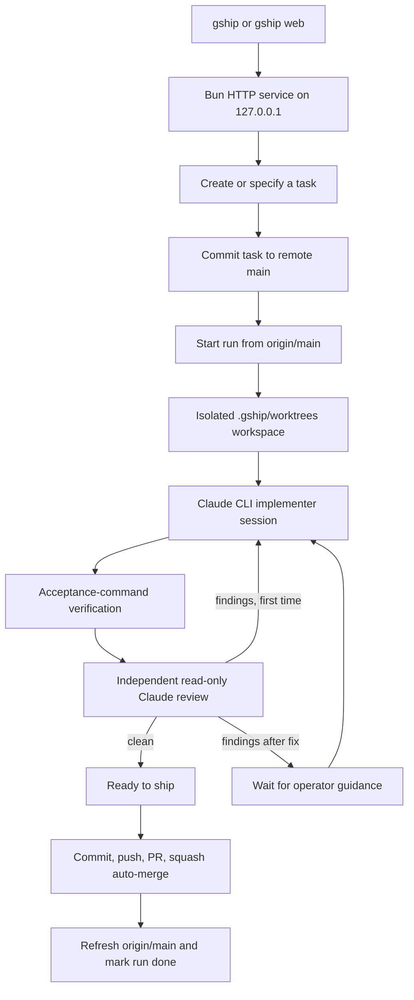

# Gateship flow

Gateship now has one operator entry point: a localhost web service backed by a
durable SQLite run store. Bare `gship`, `gship web`, and the compatibility alias
`gship run` all start this same service. None of them creates a tmux session.

## Ownership

- `RunRuntime` owns the run state machine and process cancellation.
- `RunStore` persists runs and events in `.gship/runtime.sqlite`.
- `GitWorkspaceManager` creates one isolated worktree per run from
  `origin/main`; it never moves the local `main` branch.
- `ClaudeCliExecutor` owns the resumable implementation session.
- `GitIssueVerifier` runs the acceptance commands from the task contract.
- `ClaudeCliReviewer` starts a fresh read-only session for independent review.
- `GithubShipper` owns commit, push, PR creation, squash auto-merge, and source
  refresh after a real merge.
- The browser observes durable events through SSE and sends explicit start,
  resume, cancel, and ship commands back to the service.

## Retired runtime

No tmux, sidecar, container-worker, or terminal-control compatibility path
remains. Recovery is the durable run state plus explicit resume in the web UI.
