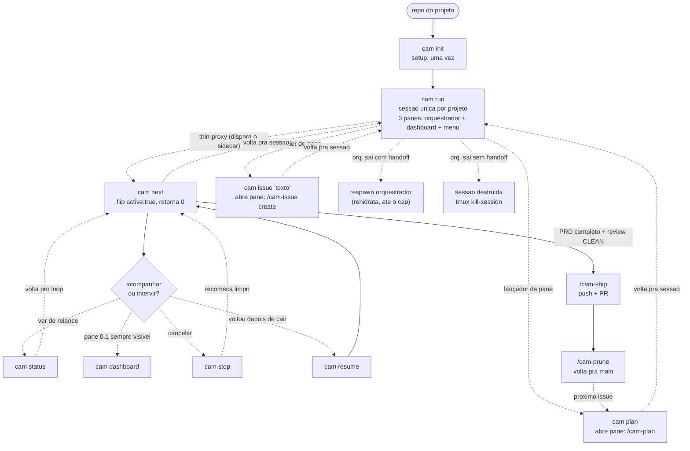
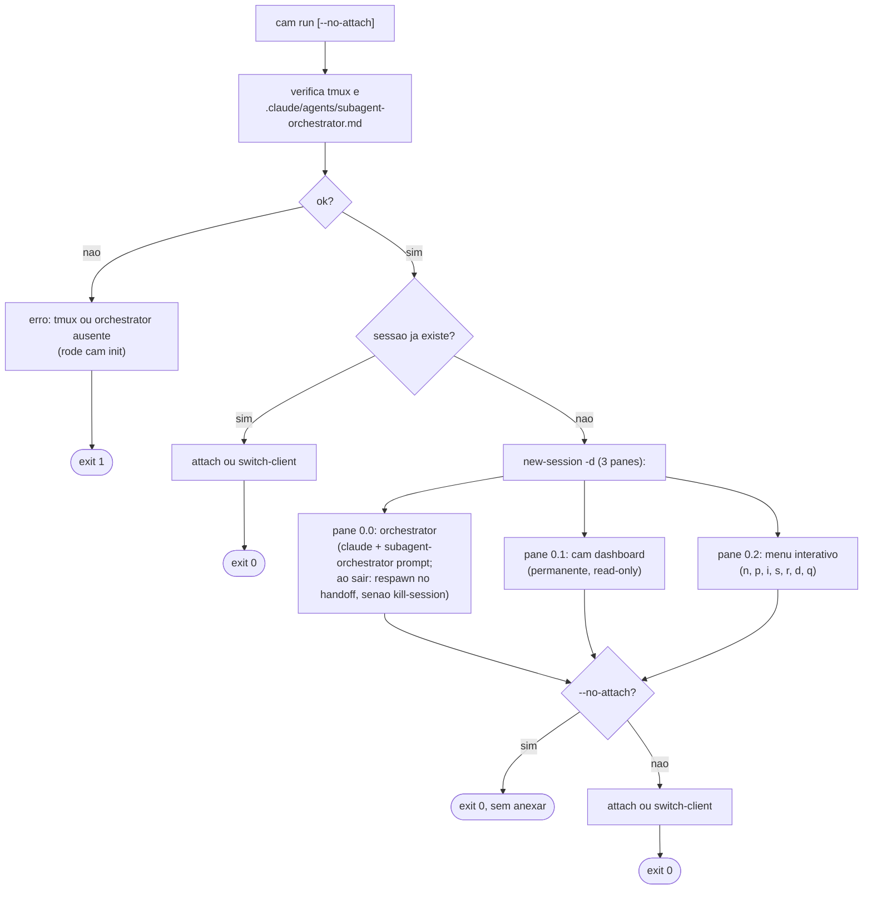
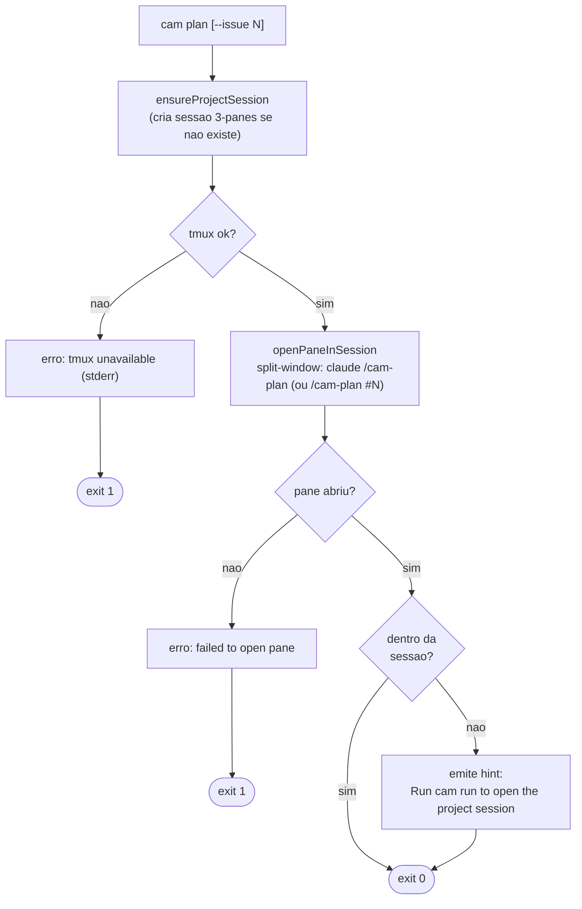
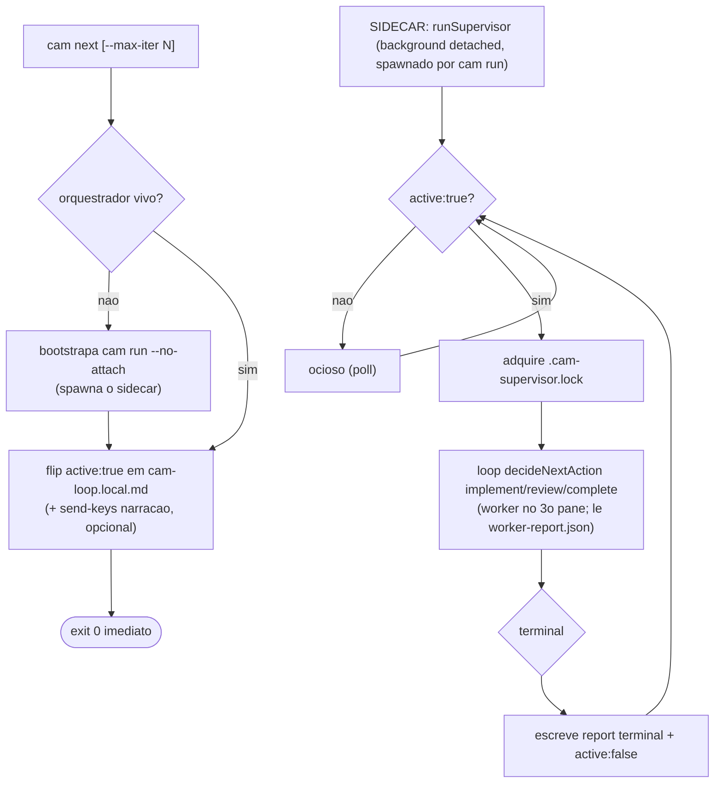
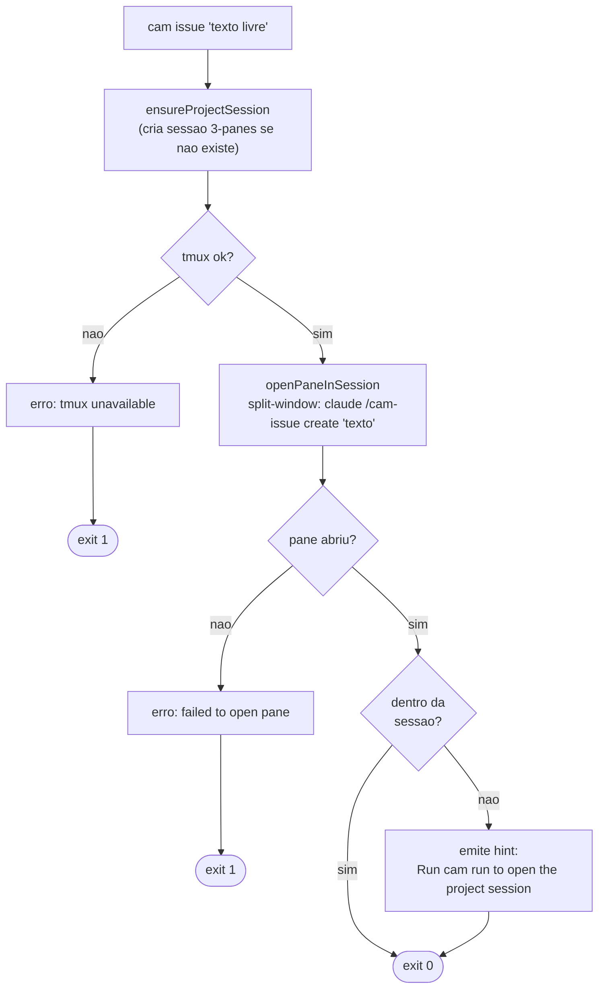
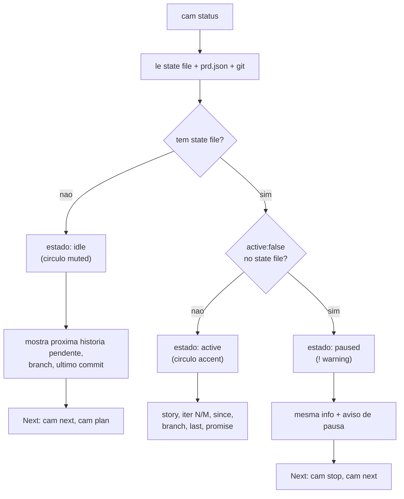
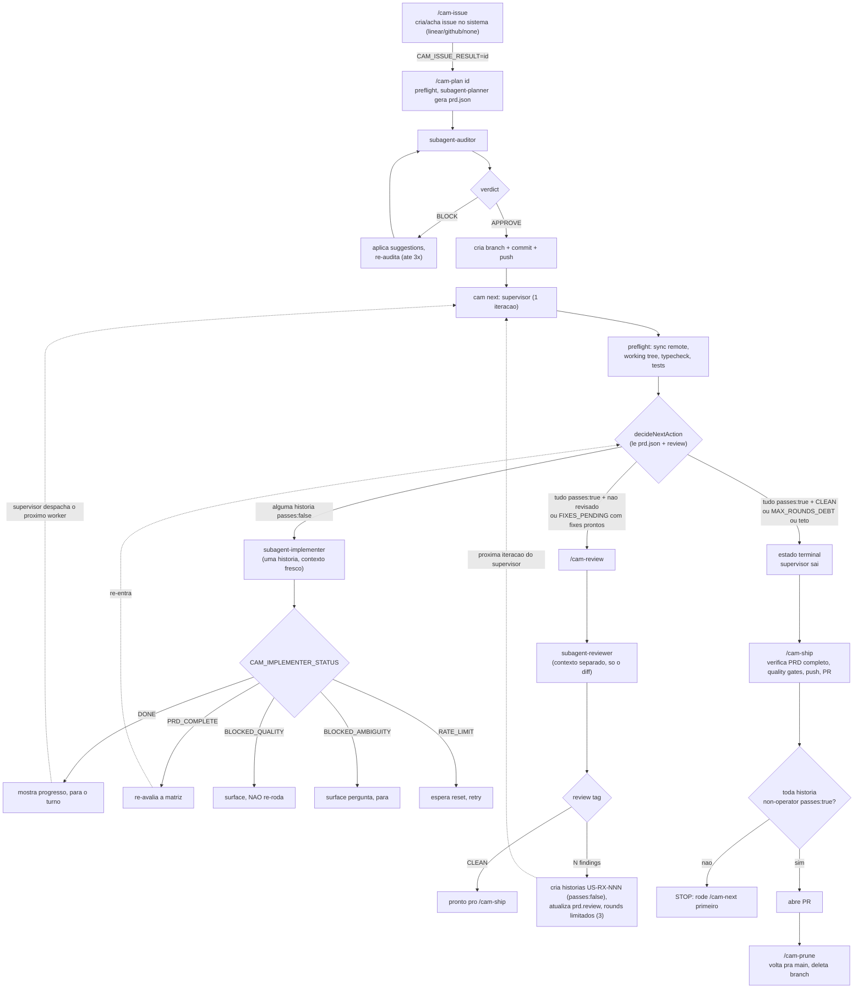
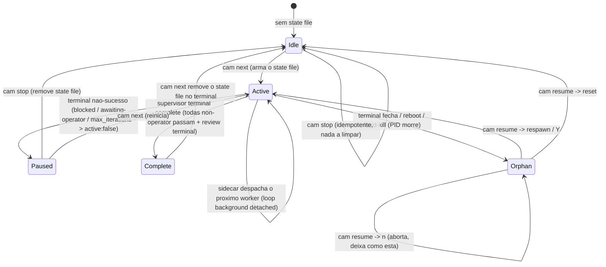

# FLOW: mapa das telas do cam-cli

Mapa de como as telas (surfaces) do `cam` se conectam conforme as decisões do operador.
Os diagramas são Mermaid: renderizam como diagramas reais no GitHub ou no preview de
markdown do VS Code. O texto em volta resume cada bifurcação.

Convenção dos diagramas:

- Retângulo: uma tela ou um passo que produz output.
- Losango: ponto de decisão (uma escolha do operador ou um galho automático).
- Linha cheia: transição que sempre acontece.
- Linha pontilhada: transição condicional, alternativa, ou "depois, manualmente".
- `exit N`: código de saída do processo naquele ramo.

Inventário rápido de quem renderiza o quê:

| Comando | Render | Telas / estados |
|---|---|---|
| `cam help`, `cam <cmd> --help` | print path (`renderHelp`) | uma tela estática por comando |
| `cam init` | Ink (`Splash` + `InitScreen`, `SetupScreen`) com fallback linear em CI | validação de máquina, wizard, tmux |
| `cam run` | print path + tmux | sessão orchestrator (3 panes: orquestrador + dashboard + menu) |
| `cam plan` | print path + tmux (pane launcher) | abre pane na sessão, retorna 0 imediatamente |
| `cam next` | print path + thin-proxy | liga `active:true` (dispara o sidecar), retorna 0 imediatamente |
| `cam issue` | print path + tmux (pane launcher) | abre pane na sessão, retorna 0 imediatamente |
| `cam dashboard` | Ink (alt-screen) | TUI read-only; pane 0.1 permanente na sessão |
| `cam status` | print path | idle / active / paused |
| `cam stop` | print path | cleanup |
| `cam resume` | print path + `promptSelect` (Ink) | summary + 5 modos auto + 3 modos reset |
| `cam claude` | print path + retry-monitor | print mode com retry de rate-limit |

---

## 1. Mapa de comandos (o ciclo de vida do projeto)

Como o operador navega entre comandos ao longo da vida de um projeto. As caixas
pontilhadas marcam o que roda DENTRO de uma sessão claude (os slash commands),
detalhado na seção 7.

Resumo da espinha dorsal: `init` (uma vez) prepara a máquina e instala templates.
`run` abre a sessão única por projeto com 3 panes: pane 0.0 é o orquestrador, pane 0.1
é o `cam dashboard` permanente (sempre visível), pane 0.2 é o menu interativo. `plan`
e `issue` são lançadores de pane: abrem um pane novo na sessão e retornam 0
imediatamente; `next` também é thin-proxy (não abre pane), só liga `active:true` e
dispara o sidecar (o `runSupervisor` background spawnado pelo `cam run`), que corre o loop.
Quando o orquestrador (pane 0.0) sai, o wrapper respawna se houver um handoff de
cycle-close (por-ciclo) pendente, senão destrói a sessão. Quando o PRD fecha com review limpo, o
sidecar chega ao terminal, o PR vai via `/cam-ship` e `/cam-prune`
limpa a branch.

---

## 2. cam init (validacao de maquina + wizard)

Duas etapas. A etapa 1 valida a máquina; só se ela passar a etapa 2 (wizard) roda.
A renderização muda conforme o terminal: TTY interativo usa as telas Ink, CI ou pipe
cai no caminho linear (readline / prints).

Decisões que mudam a tela: **TTY vs CI** (Ink vs linear), **falha na validação**
(stderr + para), **new vs existing** (pergunta extra de descrição só no new),
**issue system** (muda só o hint de credencial: LINEAR_API_KEY vs gh auth),
**`--no-tmux`** (instala e sai vs abre a sessão de config com handoff pro orchestrator).

---

## 2.5. cam run (sessao unica por projeto: 3-pane layout)

`cam run` é o ponto central: abre (ou re-anexa) a sessão única do projeto. O nome
da sessão é estável por projeto (`cam-orch-<basename>-<hash>`). Se a sessão já existe,
o comando anexa ou faz `switch-client` (dentro do tmux). Se não existe, cria com 3 panes.

Todos os comandos de sessão do cam usam o socket dedicado `tmux -L cam`, isolado
do socket padrão do tmux. Esse isolamento evita colisão com sessões acumuladas
(ex: `claude-retry-*` do claude-auto-retry) e protege contra um problema específico
do macOS: um servidor tmux deixado por uma sessão de segurança morta nega acesso TCC
a `~/Documents`, causando falha silenciosa do Claude Code. Com `tmux -L cam`, o cam
sempre parte de um servidor limpo com o contexto de segurança correto para o login atual.

Exceção intencional: `cam claude` e `cam retry-monitor` ficam no socket ambiente do
usuário, pois monitoram o pane interativo do usuário, nao a sessao do workspace do cam.

Quando o `claude` do pane 0.0 sai, o wrapper do `cam run` respawna o orquestrador
(rehidratando de um handoff de cycle-close) se houver um pendente e dentro do cap
de respawns; senao encadeia `; tmux kill-session -t <sessao>` e os 3 panes somem. O
dashboard (pane 0.1) é sempre visivel enquanto a sessao existe.

---

## 3. cam plan (lancador de pane: abre /cam-plan na sessao)

`cam plan` é um lançador fino: garante que a sessão do projeto existe, abre um pane
novo nela com `claude --permission-mode <mode> "/cam-plan"`, e retorna 0 imediatamente.
O flow de planning (incluindo o prompt APPROVE) corre dentro do pane. Se o operador
rodar `cam plan` de fora da sessão, um hint imprime o comando `cam run` para se anexar.

Decisao chave: `cam plan` retorna 0 imediatamente. O orquestrador (pane 0.0) e o
dashboard (pane 0.1) continuam rodando enquanto o pane de planning executa em paralelo.
Sem `--issue`, o planner pick o issue de maior prioridade pendente por conta proprio.

---

## 4. cam next (thin-proxy que dispara o sidecar)

`cam next` NÃO roda o supervisor no próprio processo. Ele é um thin-proxy (mesmo modelo
de `cam plan`/`issue`/`review`/`ship`): liga o flag `active: true` no state file
`.claude/cam-loop.local.md` para disparar o SIDECAR, e opcionalmente injeta uma narração
em linguagem natural no pane do orquestrador via send-keys atômico (texto + Enter na MESMA
chamada, sem `-l`). Retorna imediatamente.

O **sidecar** é o supervisor determinístico (`runSupervisor`, `src/supervisor/loop.ts`)
rodando como processo background detached, spawnado pelo `cam run` (não pelo `cam next`).
Ele é gated no flag `active`: ocioso enquanto `active: false`; ao ver `active: true` com
histórias não-operator pendentes, adquire o lock de supervisor único e corre o loop
implement-review-complete, despachando cada worker (claude TUI interativo) no pane de
worker reusado (titulado, via `respawn-pane -k`). A conclusão é detectada lendo o
push-report-file `scripts/cam/worker-report.json` (não mais pollando o scrollback atrás do
sentinel). Ao chegar num estado terminal, escreve o report terminal e zera `active: false`.
As flags `--max-iter N` e `--completion-promise S` continuam aceitas (a promise é só
registrada no state file para display via `cam status`, não dirige a terminação).

Decisao chave: o loop corre no SIDECAR (processo background detached spawnado por `cam run`),
NÃO in-process no `cam next` nem absorvido pelo orquestrador LLM. O `cam next` só dispara
(flip `active:true`). O pane de worker (3o pane, titulado por `@cam_label`) é reusado a cada
história via `respawn-pane -k`. A sessão do projeto tem orquestrador (pane 0.0) + dashboard
(pane 0.1) permanentes; o worker é o 3o pane sob mutex. Nao ha deteccao de host: a sessao
unica por projeto e a fonte de verdade, independente do terminal do operador.

Guardrails por worker: cada despacho tem dois tetos. (1) Wall-clock: `perWorkerTimeoutMs`
(default 30min, env `CAM_WORKER_TIMEOUT_MS`); ao estourar, o pane é morto e a iteração
bloqueia. (2) Tokens (opt-in, CAM-5): `CAM_WORKER_MAX_TOKENS` (default 0 = desligado); o
loop de sentinel lê o gasto do worker no transcript a cada tick (spend = input +
cacheCreation + cacheRead, a mesma fórmula do `cam orch-budget`) e, ao cruzar o teto, mata
o pane e bloqueia terminalmente (evento `worker-token-ceiling`). O cap de turns é o
`maxIterations` do supervisor (`--max-iter`, default 50). Os flags `claude --max-turns` e
`--max-budget-usd` NÃO são usados: são print-mode-only (exigem `-p`, proibido em
subscrição, CAM-42), e budget em USD é N/A em subscrição (sem billing por chamada).

---

## 4.5. cam issue (lancador de pane: abre /cam-issue create na sessao)

`cam issue "<texto livre>"` é um lançador fino. O texto é passado verbatim ao slash
command `/cam-issue create`, que expande para título + descrição estruturada. Retorna
0 imediatamente; o pane agent cuida do rest.

O mesmo padrao de pane launcher de `cam plan`. A diferença: o comando injetado no
pane é `/cam-issue create <texto>`, nao um planner. (`cam next` nao e um lançador de
pane: e um thin-proxy que liga `active:true` para disparar o SIDECAR.)

---

## 5. cam resume (arvore de recuperacao)

`cam resume` reconcilia o estado depois de uma interrupção. Sem `--mode`, ele
classifica automaticamente lendo três fontes (state file, prd.json, último commit
+ PIDs vivos) e cai num de cinco modos. Com `--mode`, pula a classificação e faz
um reset explícito. A ordem de classificação importa e está no diagrama.

Notas: `--dry-run` curto-circuita qualquer mutação ou spawn em todos os ramos
(classifica e imprime, exit 0). `reset-branch` nunca roda `git reset` sozinho:
ele imprime o comando pro operador copiar, justamente pra não destruir trabalho
por classificação errada.

---

## 6. cam status (estados do loop)

Leitura read-only de três fontes (state file, prd.json, git). Sempre sai 0. A tela
muda conforme o estado e oferece uma seção "Next" com o que fazer em seguida.

---

## 7. O loop autonomo (slash commands dentro do claude)

Isto é o ciclo de vida que o SIDECAR dirige (processo background detached, spawnado pelo
`cam run`). O sidecar (`runSupervisor`, `src/supervisor/loop.ts`) fica gateado no flag
`active` do state file; quando `cam next` liga `active:true`, o sidecar adquire o lock e
chama `decideNextAction`, que lê `prd.json` + o veredito de review para decidir implement /
review / complete, despacha um worker por história, e repete até o estado terminal. Nao ha
stop hook nem `<promise>COMPLETE</promise>` dirigindo a terminacao: o loop termina quando
todas as historias non-operator passam E o review e terminal (CLEAN ou MAX_ROUNDS_DEBT).
O orchestrator LLM (pane 0.0) NARRA o report terminal do sidecar e roteia os
slash-commands de cerimonia (/cam-plan, /cam-review, /cam-ship, /cam-issue, /cam-prune)
como interface humana -- ele NAO dirige o loop de implement/review.

Como o loop "anda" sozinho: o SIDECAR (`runSupervisor`, processo background detached
spawnado pelo `cam run`) itera internamente. A cada volta chama `decideNextAction(prd)`,
despacha o worker certo (implementer ou reviewer, sessao claude TUI no pane reusado),
aguarda o push-report-file (`scripts/cam/worker-report.json`) que o worker escreve ao
terminar, le o desfecho e repete, ate o estado terminal ou o teto `max_iterations`.
O desfecho e state-primary (CAM-32): `handoff.json` (qual historia) + `prd.json`
`passes:true` (feito) sao autoritativos; o sentinel `CAM_*_STATUS` no scrollback e
so corroboracao/fallback, nunca gate primario -- o gate primario e o report-file.
A alternativa de eventos estruturados via `-p --output-format stream-json
--include-hook-events` e deliberadamente NAO usada, porque `claude -p` e proibido em
contas de subscricao (CAM-42): o sinal estruturado vive nos arquivos de estado em disco
(`handoff.json` / `prd.json`), nao num stream de eventos.

---

## 8. State machine do loop (e como stop / resume / status se ligam a ele)

Tudo gira em torno de um arquivo: `.claude/cam-loop.local.md`. Sua presença e o campo
`active` definem o estado que `cam status` reporta, e o trio PID + último commit +
retry-monitor define o que `cam resume` decide.

Quem mexe em quê:

- **`cam next`** liga `active:true` no state file (Idle para Active), injetando a narração
  no pane do orquestrador via send-keys atômico. O SIDECAR (já rodando em background desde
  o `cam run`) detecta `active:true`, adquire o lock, itera despachando workers, e chega a
  Complete removendo o file no estado terminal.
- **`cam status`** só lê: presença do file e `active` decidem idle / active / paused.
- **`cam stop`** remove o state file e mata a sessão tmux `cam` (Active/Paused para Idle); idempotente.
- **`cam resume`** age sobre o Orphan (PID morto + file presente), escolhendo respawn,
  reset, ou abortar conforme idade do último commit e resposta do operador.
- **`cam claude` / retry-monitor** registra seu PID em `~/.cam/retry.pid`; é isso que
  faz `cam resume` cair em `noop` (o monitor respawna o loop quando a janela de
  rate-limit fecha).

---

## 9. supervisor/dispatch (CAM-55: tres decisoes arquiteturais)

CAM-55 fixa tres perguntas abertas de design sobre como os subcomandos CLI e o supervisor
interagem com o orquestrador (a Q1 foi re-decidida no fix-cycle para o modelo sidecar). As respostas abaixo estao decididas e congeladas; as historias
seguintes codificam a implementacao sem precisar re-decidir.

**Q1: onde o loop determinístico roda (modelo SIDECAR).**
O loop determinístico (`runSupervisor`, `src/supervisor/loop.ts`) roda como um SIDECAR: um
processo background detached spawnado pelo `cam run`, gated no flag `active` do state file
`.claude/cam-loop.local.md`. `cam next` (e os outros thin-proxies) só liga `active:true`
para disparar; o sidecar adquire o lock de supervisor único e corre o loop. A
completion-detection muda de polling de scrollback (`capture-pane` atrás do sentinel
`CAM_*_STATUS`) para um push-report-file (`scripts/cam/worker-report.json`): o worker
escreve o resultado estruturado ao terminar, o sidecar lê esse arquivo. Isso elimina a
classe de fragilidade documentada em `supervisor-sentinel-parse-fragility.md` (falsos
positivos de sentinel no scrollback, sentinel em markdown, pane morto).

REJEITADO: o modelo "o orquestrador LLM absorve o loop" (o orquestrador recebe o report e
ele mesmo decide/dispara a próxima história, sem supervisor determinístico). Esse modelo
perde os guards determinísticos que vivem no `runSupervisor`: streak de no-progress
(CAM-36), backoff de worker morto (CAM-44), `MAX_ITERATIONS`, o lock de supervisor único, e
o event log. Um loop dirigido por LLM é não-determinístico e não tem como garantir esses
limites. O sidecar mantém o loop determinístico; o orquestrador LLM só narra o report
terminal e roteia os outros slash-commands (plan/review/ship/issue) como interface humana.

**Q2: thin-proxies e o marker `.claude/.cam-orch-ready`.**
Os subcomandos CLI (`cam plan`, `cam issue`) sao thin-proxies. Fluxo:
(a) detecta a sessao do orquestrador via `tmux -L cam ls`;
(b) se ausente, bootstrapa `cam run --no-attach`;
(c) aguarda o marker `.claude/.cam-orch-ready` no disco (arquivo criado pelo orquestrador
    ao terminar a inicializacao do TUI e estar pronto para receber comandos);
(d) injeta o pedido via `send-keys` atomico no pane 0.0 (texto + Enter na mesma chamada).
Sem o marker, o proxy nao tem garantia de que o TUI do orquestrador esta pronto e pode
injetar antes que o Ink inicialize, perdendo o comando silenciosamente.

**Q3: idle-guarantee e historia separada.**
A garantia de que o orquestrador esta idle (nao no meio de uma tarefa) antes de o worker
fazer o push-report nao e incluida no proxy. E a historia US-008, implementada
em separado. A separacao evita acoplamento prematuro: Q2 (bootstrap + wait-marker) e Q3
(idle-check antes do push) sao camadas com razoes de mudanca diferentes e podem ser
testadas e revertidas de forma independente.
