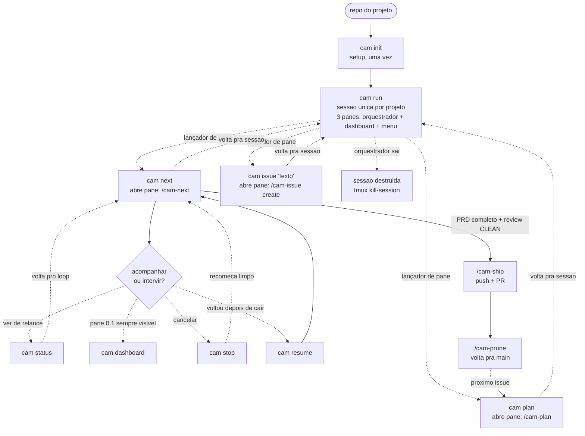
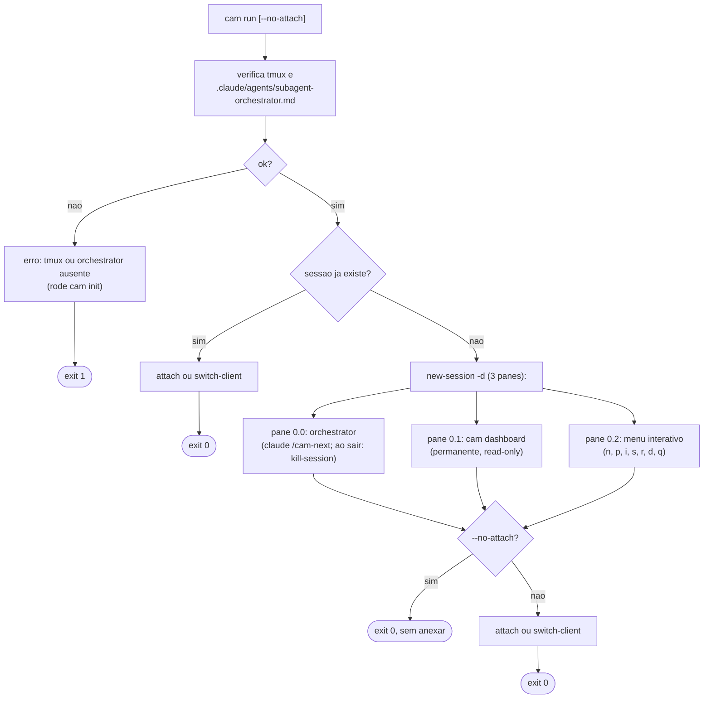
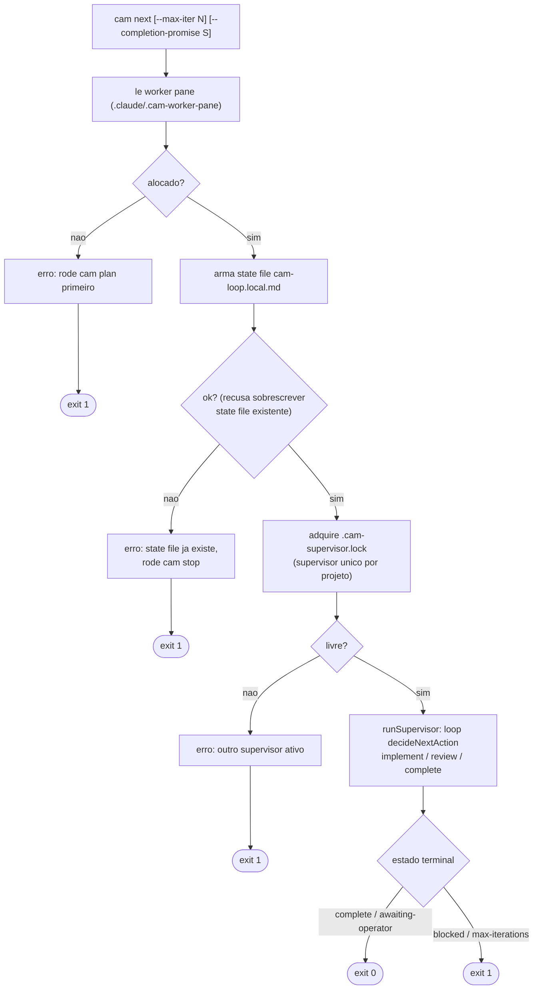
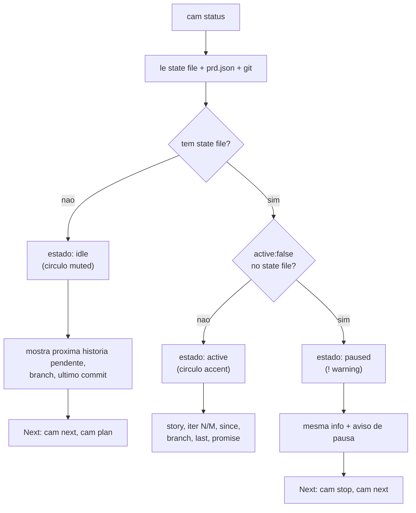
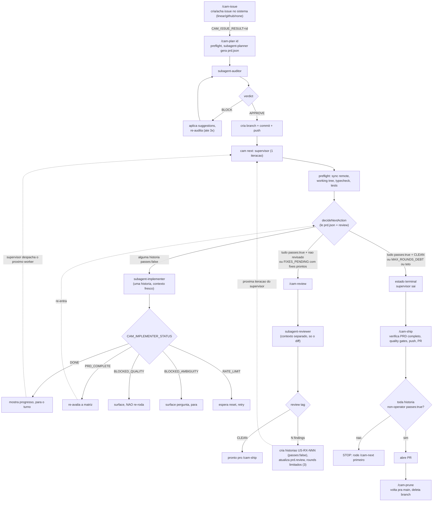
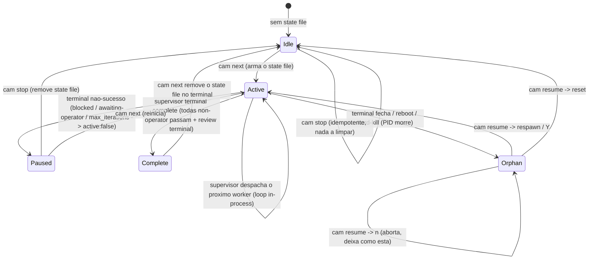

# FLOW: mapa das telas do cam-cli

Mapa de como as telas (surfaces) do `cam` se conectam conforme as decisões do operador.
Os diagramas são Mermaid: renderizam como diagramas reais no GitHub ou no preview de
markdown do VS Code. O texto em volta resume cada bifurcação.

Convenção dos diagramas:

- Retângulo: uma tela ou um passo que produz output.
- Losango: ponto de decisão (uma escolha do operador ou um galho automático).
- Linha cheia: transição que sempre acontece.
- Linha pontilhada: transição condicional, alternativa, ou "depois, manualmente".
- `exit N`: código de saída do processo naquele ramo.

Inventário rápido de quem renderiza o quê:

| Comando | Render | Telas / estados |
|---|---|---|
| `cam help`, `cam <cmd> --help` | print path (`renderHelp`) | uma tela estática por comando |
| `cam init` | Ink (`Splash` + `InitScreen`, `SetupScreen`) com fallback linear em CI | validação de máquina, wizard, tmux |
| `cam run` | print path + tmux | sessão orchestrator (3 panes: orquestrador + dashboard + menu) |
| `cam plan` | print path + tmux (pane launcher) | abre pane na sessão, retorna 0 imediatamente |
| `cam next` | print path + tmux (pane launcher) | abre pane na sessão, retorna 0 imediatamente |
| `cam issue` | print path + tmux (pane launcher) | abre pane na sessão, retorna 0 imediatamente |
| `cam dashboard` | Ink (alt-screen) | TUI read-only; pane 0.1 permanente na sessão |
| `cam status` | print path | idle / active / paused |
| `cam stop` | print path | cleanup |
| `cam resume` | print path + `promptSelect` (Ink) | summary + 5 modos auto + 3 modos reset |
| `cam claude` | print path + retry-monitor | print mode com retry de rate-limit |

---

## 1. Mapa de comandos (o ciclo de vida do projeto)

Como o operador navega entre comandos ao longo da vida de um projeto. As caixas
pontilhadas marcam o que roda DENTRO de uma sessão claude (os slash commands),
detalhado na seção 7.

Resumo da espinha dorsal: `init` (uma vez) prepara a máquina e instala templates.
`run` abre a sessão única por projeto com 3 panes: pane 0.0 é o orquestrador, pane 0.1
é o `cam dashboard` permanente (sempre visível), pane 0.2 é o menu interativo. `plan`,
`next` e `issue` são lançadores de pane: abrem um pane novo na sessão e retornam 0
imediatamente. Quando o orquestrador (pane 0.0) sai, a sessão inteira é destruída
automaticamente. Quando o PRD fecha com review limpo, o loop emite `COMPLETE`, abre o
PR via `/cam-ship` e `/cam-prune` limpa a branch.

---

## 2. cam init (validacao de maquina + wizard)

Duas etapas. A etapa 1 valida a máquina; só se ela passar a etapa 2 (wizard) roda.
A renderização muda conforme o terminal: TTY interativo usa as telas Ink, CI ou pipe
cai no caminho linear (readline / prints).

Decisões que mudam a tela: **TTY vs CI** (Ink vs linear), **falha na validação**
(stderr + para), **new vs existing** (pergunta extra de descrição só no new),
**issue system** (muda só o hint de credencial: LINEAR_API_KEY vs gh auth),
**`--no-tmux`** (instala e sai vs abre a sessão de config com handoff pro orchestrator).

---

## 2.5. cam run (sessao unica por projeto: 3-pane layout)

`cam run` é o ponto central: abre (ou re-anexa) a sessão única do projeto. O nome
da sessão é estável por projeto (`cam-orch-<basename>-<hash>`). Se a sessão já existe,
o comando anexa ou faz `switch-client` (dentro do tmux). Se não existe, cria com 3 panes.

Todos os comandos de sessão do cam usam o socket dedicado `tmux -L cam`, isolado
do socket padrão do tmux. Esse isolamento evita colisão com sessões acumuladas
(ex: `claude-retry-*` do claude-auto-retry) e protege contra um problema específico
do macOS: um servidor tmux deixado por uma sessão de segurança morta nega acesso TCC
a `~/Documents`, causando falha silenciosa do Claude Code. Com `tmux -L cam`, o cam
sempre parte de um servidor limpo com o contexto de segurança correto para o login atual.

Exceção intencional: `cam claude` e `cam retry-monitor` ficam no socket ambiente do
usuário, pois monitoram o pane interativo do usuário, nao a sessao do workspace do cam.

O pane 0.0 encadeia `; tmux kill-session -t <sessao>` após o `claude` sair, portanto
quando o orquestrador termina (por qualquer motivo), os 3 panes somem. O dashboard
(pane 0.1) é sempre visivel enquanto a sessao existe.

---

## 3. cam plan (lancador de pane: abre /cam-plan na sessao)

`cam plan` é um lançador fino: garante que a sessão do projeto existe, abre um pane
novo nela com `claude --permission-mode <mode> "/cam-plan"`, e retorna 0 imediatamente.
O flow de planning (incluindo o prompt APPROVE) corre dentro do pane. Se o operador
rodar `cam plan` de fora da sessão, um hint imprime o comando `cam run` para se anexar.

Decisao chave: `cam plan` retorna 0 imediatamente. O orquestrador (pane 0.0) e o
dashboard (pane 0.1) continuam rodando enquanto o pane de planning executa em paralelo.
Sem `--issue`, o planner pick o issue de maior prioridade pendente por conta proprio.

---

## 4. cam next (supervisor in-process)

`cam next` roda o supervisor determinístico (`runSupervisor`, `src/supervisor/loop.ts`)
no próprio processo. Ele lê o pane de worker alocado por `cam plan`, arma o state file,
adquire o lock de supervisor único e entra no loop implement-review-complete. NÃO há
stop hook, NÃO registra nada em `settings.local.json`, e NÃO abre um pane `/cam-next`:
o supervisor despacha cada worker (claude TUI interativo) no pane de worker reusado via
`respawn-pane` e detecta conclusão pollando `capture-pane` atrás do sentinel. Retorna ao
chegar num estado terminal. As flags `--max-iter N` e `--completion-promise S` continuam
aceitas (a promise é só registrada no state file para display via `cam status`, não
dirige a terminação).

Decisao chave: o loop corre IN-PROCESS no `cam next`, não num pane separado nem via
re-injeção de slash command. O pane de worker (alocado por `cam plan`) é reusado a cada
história via `respawn-pane`. A sessão do projeto já tem pane 0.1 (`cam dashboard`)
permanente e pane 0.2 (menu). Nao ha deteccao de host: a sessao unica por projeto e a
fonte de verdade, independente do terminal do operador.

Guardrails por worker: cada despacho tem dois tetos. (1) Wall-clock: `perWorkerTimeoutMs`
(default 30min, env `CAM_WORKER_TIMEOUT_MS`); ao estourar, o pane é morto e a iteração
bloqueia. (2) Tokens (opt-in, CAM-5): `CAM_WORKER_MAX_TOKENS` (default 0 = desligado); o
loop de sentinel lê o gasto do worker no transcript a cada tick (spend = input +
cacheCreation + cacheRead, a mesma fórmula do `cam orch-budget`) e, ao cruzar o teto, mata
o pane e bloqueia terminalmente (evento `worker-token-ceiling`). O cap de turns é o
`maxIterations` do supervisor (`--max-iter`, default 50). Os flags `claude --max-turns` e
`--max-budget-usd` NÃO são usados: são print-mode-only (exigem `-p`, proibido em
subscrição, CAM-42), e budget em USD é N/A em subscrição (sem billing por chamada).

---

## 4.5. cam issue (lancador de pane: abre /cam-issue create na sessao)

`cam issue "<texto livre>"` é um lançador fino. O texto é passado verbatim ao slash
command `/cam-issue create`, que expande para título + descrição estruturada. Retorna
0 imediatamente; o pane agent cuida do rest.

O mesmo padrao de pane launcher de `cam plan` e `cam next`. A diferença: o comando
injetado no pane é `/cam-issue create <texto>`, nao um loop ou planner.

---

## 5. cam resume (arvore de recuperacao)

`cam resume` reconcilia o estado depois de uma interrupção. Sem `--mode`, ele
classifica automaticamente lendo três fontes (state file, prd.json, último commit
+ PIDs vivos) e cai num de cinco modos. Com `--mode`, pula a classificação e faz
um reset explícito. A ordem de classificação importa e está no diagrama.

Notas: `--dry-run` curto-circuita qualquer mutação ou spawn em todos os ramos
(classifica e imprime, exit 0). `reset-branch` nunca roda `git reset` sozinho:
ele imprime o comando pro operador copiar, justamente pra não destruir trabalho
por classificação errada.

---

## 6. cam status (estados do loop)

Leitura read-only de três fontes (state file, prd.json, git). Sempre sai 0. A tela
muda conforme o estado e oferece uma seção "Next" com o que fazer em seguida.

---

## 7. O loop autonomo (slash commands dentro do claude)

Isto é o ciclo de vida que o supervisor de `cam next` dirige (e que o orchestrator de
`cam run` dispara sob demanda). O supervisor determinístico (`runSupervisor`) chama
`decideNextAction`, que lê `prd.json` + o veredito de review para decidir implement /
review / complete, despacha um worker por história, e repete in-process até o estado
terminal. Não há stop hook nem `<promise>COMPLETE</promise>` dirigindo a terminação: o
loop termina quando todas as histórias non-operator passam E o review é terminal (CLEAN
ou MAX_ROUNDS_DEBT). Os passos `/cam-issue`, `/cam-plan`, `/cam-review`, `/cam-ship`,
`/cam-prune` abaixo são as cerimônias slash que o operador (ou o orchestrator) roda em
volta do loop de implement/review que o supervisor automatiza.

Como o loop "anda" sozinho: o supervisor (`runSupervisor`, in-process no `cam next`)
itera internamente. A cada volta chama `decideNextAction(prd)`, despacha o worker certo
(implementer ou reviewer, sessão claude TUI no pane reusado), espera o sentinel via
`capture-pane`, lê o desfecho e repete, até o estado terminal ou o teto `max_iterations`.
O desfecho é state-primary (CAM-32): `handoff.json` (qual história) + `prd.json`
`passes:true` (feito) são autoritativos; o sentinel `CAM_*_STATUS` / `<review>` no pane é
só corroboração, nunca gate. A alternativa de eventos estruturados via
`-p --output-format stream-json --include-hook-events` é deliberadamente NÃO usada, porque
`claude -p` é proibido em contas de subscrição (CAM-42): o sinal estruturado vive nos
arquivos de estado em disco (`handoff.json` / `prd.json`), não num stream de eventos.

---

## 8. State machine do loop (e como stop / resume / status se ligam a ele)

Tudo gira em torno de um arquivo: `.claude/cam-loop.local.md`. Sua presença e o campo
`active` definem o estado que `cam status` reporta, e o trio PID + último commit +
retry-monitor define o que `cam resume` decide.

Quem mexe em quê:

- **`cam next`** cria o state file (Idle para Active), grava o PID do processo dono, e
  roda o supervisor in-process: mantém Active vivo (itera, despachando workers) ou chega a
  Complete e remove o file no estado terminal.
- **`cam status`** só lê: presença do file e `active` decidem idle / active / paused.
- **`cam stop`** remove o state file e mata a sessão tmux `cam` (Active/Paused para Idle); idempotente.
- **`cam resume`** age sobre o Orphan (PID morto + file presente), escolhendo respawn,
  reset, ou abortar conforme idade do último commit e resposta do operador.
- **`cam claude` / retry-monitor** registra seu PID em `~/.cam/retry.pid`; é isso que
  faz `cam resume` cair em `noop` (o monitor respawna o loop quando a janela de
  rate-limit fecha).
