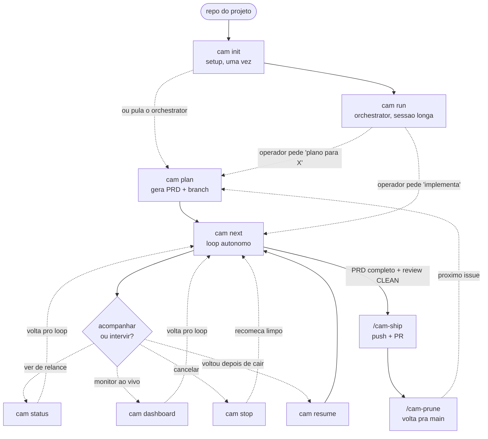
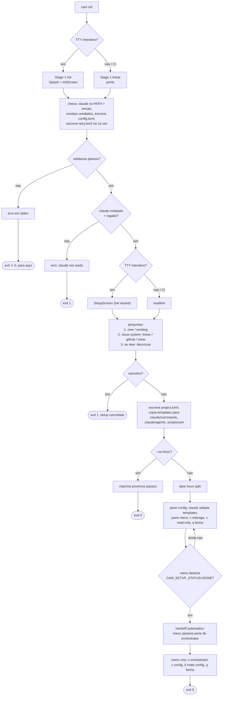
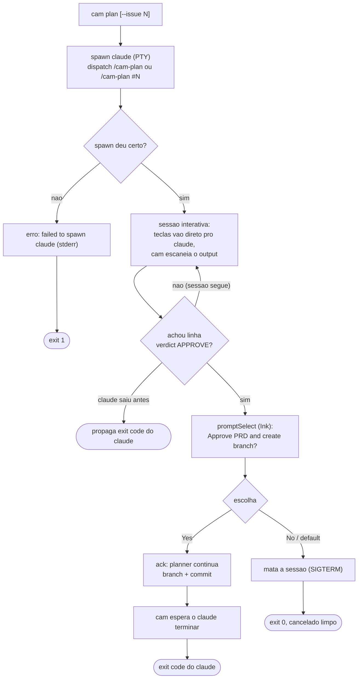
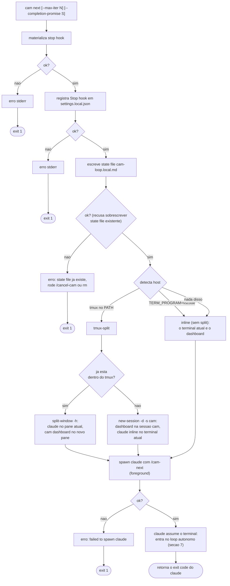
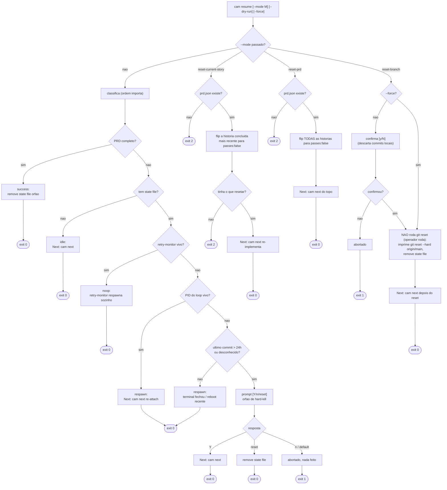
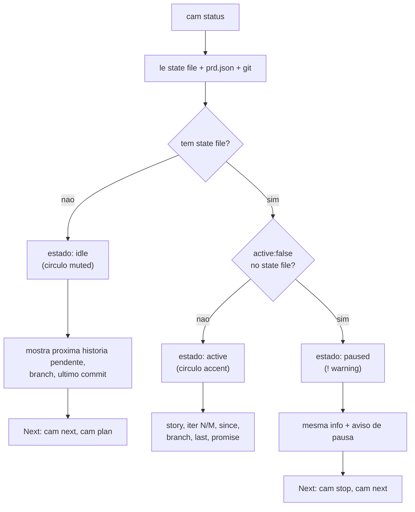
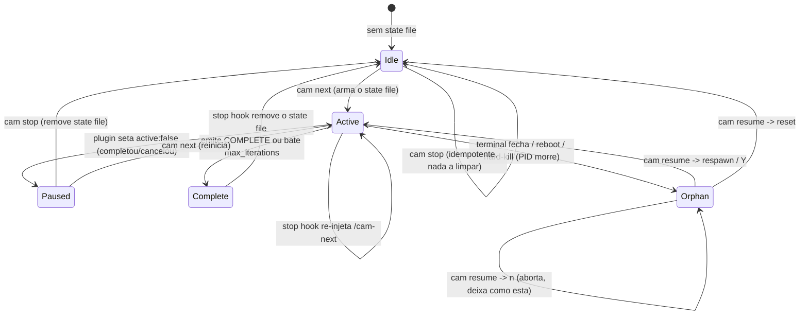

# FLOW: mapa das telas do cam-cli

Mapa de como as telas (surfaces) do `cam` se conectam conforme as decisões do operador.
Os diagramas são Mermaid: renderizam como diagramas reais no GitHub ou no preview de
markdown do VS Code. O texto em volta resume cada bifurcação.

Convenção dos diagramas:

- Retângulo: uma tela ou um passo que produz output.
- Losango: ponto de decisão (uma escolha do operador ou um galho automático).
- Linha cheia: transição que sempre acontece.
- Linha pontilhada: transição condicional, alternativa, ou "depois, manualmente".
- `exit N`: código de saída do processo naquele ramo.

Inventário rápido de quem renderiza o quê:

| Comando | Render | Telas / estados |
|---|---|---|
| `cam help`, `cam <cmd> --help` | print path (`renderHelp`) | uma tela estática por comando |
| `cam init` | Ink (`Splash` + `InitScreen`, `SetupScreen`) com fallback linear em CI | validação de máquina, wizard, tmux |
| `cam run` | print path + tmux | sessão orchestrator (2 panes) |
| `cam plan` | print path + PTY claude + `promptSelect` (Ink) | sessão de planning, prompt APPROVE |
| `cam next` | print path + spawn | Loop + Host, depois claude assume o terminal |
| `cam dashboard` | Ink (alt-screen) | TUI read-only |
| `cam status` | print path | idle / active / paused |
| `cam stop` | print path | cleanup |
| `cam resume` | print path + `promptSelect` (Ink) | summary + 5 modos auto + 3 modos reset |
| `cam claude` | print path + retry-monitor | print mode com retry de rate-limit |

---

## 1. Mapa de comandos (o ciclo de vida do projeto)

Como o operador navega entre comandos ao longo da vida de um projeto. As caixas
pontilhadas marcam o que roda DENTRO de uma sessão claude (os slash commands),
detalhado na seção 7.

Resumo da espinha dorsal: `init` (uma vez) prepara a máquina e instala templates.
`run` abre o orchestrator, que é a interface humana de longa duração. Dentro (ou fora)
dele, `plan` cria o PRD e a branch, `next` roda o loop autônomo que implementa o PRD
história por história. Enquanto o loop roda, `status`, `dashboard`, `stop` e `resume`
são as telas de observação e controle. Quando o PRD fecha com review limpo, o loop
emite `COMPLETE`, abre o PR via `/cam-ship` e `/cam-prune` limpa a branch.

---

## 2. cam init (validacao de maquina + wizard)

Duas etapas. A etapa 1 valida a máquina; só se ela passar a etapa 2 (wizard) roda.
A renderização muda conforme o terminal: TTY interativo usa as telas Ink, CI ou pipe
cai no caminho linear (readline / prints).

Decisões que mudam a tela: **TTY vs CI** (Ink vs linear), **falha na validação**
(stderr + para), **new vs existing** (pergunta extra de descrição só no new),
**issue system** (muda só o hint de credencial: LINEAR_API_KEY vs gh auth),
**`--no-tmux`** (instala e sai vs abre a sessão de config com handoff pro orchestrator).

---

## 3. cam plan (sessao de planning com gate de aprovacao)

`cam plan` é um wrapper fino: spawna `claude` num PTY com `/cam-plan` (ou `/cam-plan #N`)
como primeiro turno, repassa tudo pro seu terminal, e fica escaneando o output atrás
da linha de veredito do auditor. Quando acha `APPROVE`, pausa e te pergunta se pode
deixar o planner criar a branch.

Decisão chave: o **prompt APPROVE** (Yes deixa o planner criar branch e commitar;
No mata a sessão de planning e sai 0). Se o claude sair antes de qualquer veredito,
o exit code dele é propagado como está.

---

## 4. cam next (arma o loop + detecta o host)

Antes de spawnar o claude, `cam next` arma o terreno: materializa o stop hook,
registra ele em `.claude/settings.local.json`, e escreve o state file
`.claude/cam-loop.local.md`. Qualquer falha nesses três passos é fatal. Depois,
detecta o host pra decidir se abre um split com dashboard ou roda inline.

Decisão chave: **host detection**. VS Code e ausência de tmux caem em inline
(pane único, o próprio terminal é o dashboard). Com tmux, abre o split com
`cam dashboard` ao lado; dentro do tmux usa o window atual, fora cria a sessão `cam`.

---

## 5. cam resume (arvore de recuperacao)

`cam resume` reconcilia o estado depois de uma interrupção. Sem `--mode`, ele
classifica automaticamente lendo três fontes (state file, prd.json, último commit
+ PIDs vivos) e cai num de cinco modos. Com `--mode`, pula a classificação e faz
um reset explícito. A ordem de classificação importa e está no diagrama.

Notas: `--dry-run` curto-circuita qualquer mutação ou spawn em todos os ramos
(classifica e imprime, exit 0). `reset-branch` nunca roda `git reset` sozinho:
ele imprime o comando pro operador copiar, justamente pra não destruir trabalho
por classificação errada.

---

## 6. cam status (estados do loop)

Leitura read-only de três fontes (state file, prd.json, git). Sempre sai 0. A tela
muda conforme o estado e oferece uma seção "Next" com o que fazer em seguida.

---

## 7. O loop autonomo (slash commands dentro do claude)

Isto é o que roda DENTRO da sessão claude que `cam next` spawna (e que o orchestrator
de `cam run` dispara sob demanda). O stop hook re-injeta `/cam-next` a cada turno,
formando o loop, até o assistente emitir `<promise>COMPLETE</promise>` ou bater o
teto de iterações.

Como o loop "anda" sozinho: o stop hook (`vendor/cam-loop-stop-hook.sh`, registrado
em `settings.local.json` por `cam next`) dispara no evento Stop de cada turno. Ele lê
o state file: se ainda não viu `<promise>COMPLETE</promise>` e não bateu o teto, re-injeta
`/cam-next`, e o loop re-entra na matriz de decisão. Quando vê COMPLETE ou estoura
`max_iterations`, remove o state file e o loop para.

---

## 8. State machine do loop (e como stop / resume / status se ligam a ele)

Tudo gira em torno de um arquivo: `.claude/cam-loop.local.md`. Sua presença e o campo
`active` definem o estado que `cam status` reporta, e o trio PID + último commit +
retry-monitor define o que `cam resume` decide.

Quem mexe em quê:

- **`cam next`** cria o state file (Idle para Active) e grava o PID do processo dono.
- **stop hook** mantém Active vivo (re-injeta) ou leva a Complete e remove o file.
- **`cam status`** só lê: presença do file e `active` decidem idle / active / paused.
- **`cam stop`** remove o state file e mata a sessão tmux `cam` (Active/Paused para Idle); idempotente.
- **`cam resume`** age sobre o Orphan (PID morto + file presente), escolhendo respawn,
  reset, ou abortar conforme idade do último commit e resposta do operador.
- **`cam claude` / retry-monitor** registra seu PID em `~/.cam/retry.pid`; é isso que
  faz `cam resume` cair em `noop` (o monitor respawna o loop quando a janela de
  rate-limit fecha).
