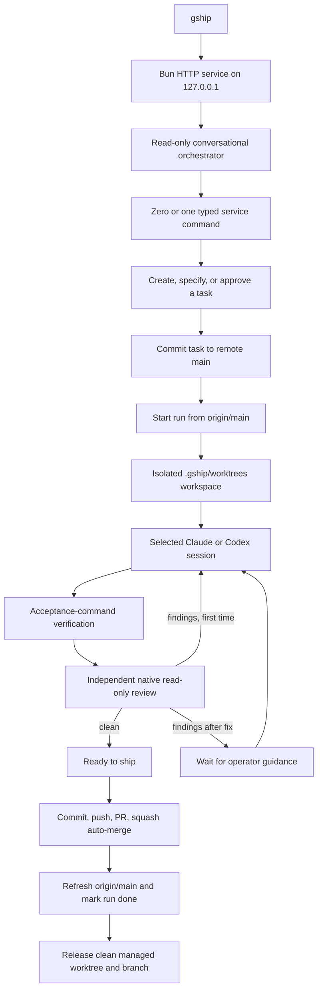

# Gateship flow

Gateship has one operator entry point: `gship`, a localhost web service backed
by a durable SQLite run store. It does not create a tmux session.

## Ownership

- `RunRuntime` owns the run state machine and process cancellation.
- `RunStore` persists runs and events in `.gship/runtime.sqlite`.
- `ConversationalOrchestrator` investigates read-only and returns at most one
  typed command. Its public transcript and one native session id per provider
  are persisted for cross-provider and cross-process handoff.
- `GitWorkspaceManager` creates one isolated worktree per run from
  `origin/main`, releases it after a confirmed merge, and preserves dirty or
  unknown leftovers for operator inspection. It never moves local `main`.
- `AgentSession` is the provider-neutral adapter contract; the selected
  Claude/Codex executor owns its resumable native session.
- `GitIssueVerifier` runs the acceptance commands from the task contract.
- Task contracts are direct `{ scope, verify[], evidence? }` records. Scope,
  verification and every optional evidence command/output are covered by the
  human approval fingerprint.
- The matching provider reviewer starts a fresh read-only session for
  independent review.
- `GithubShipper` owns commit, push, PR creation, squash auto-merge, and source
  refresh after a real merge.
- The browser is primarily a conversation. Explicit start, resume, cancel, and
  ship controls remain as a deterministic fallback; both paths reach the same
  service methods.

Recovery is the durable run state plus explicit resume in the web UI. No tmux,
sidecar, container-worker, or terminal-control path participates in this flow.
